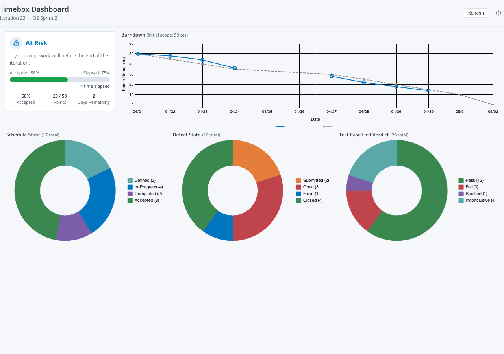

# Timebox Dashboard

A CustomAgile Rally widget that shows a full health overview of an Iteration or Release.



**Broadcom spec:** [endorsed-widgets/timebox-dashboard](https://github.com/Broadcom/rally-widgets/tree/main/endorsed-widgets/timebox-dashboard)
**Legacy reference:** Rally App Catalog — `iterationsummary` / `releasesummary`

---

## What It Shows

| Section | Description |
|---------|-------------|
| **Status badge** | Good / At Risk / Critical — symbol + label + color (colorblind-safe) |
| **Acceptance bar** | % accepted (fill) vs % elapsed (vertical marker) |
| **Schedule State chart** | Stories + defects + defect suites bucketed by Schedule State |
| **Defect State chart** | All defects scheduled in the timebox, plus defects linked to scheduled stories |
| **Test Case Last Verdict** | Pass / Fail / Blocked / Inconclusive for test cases on timebox stories |
| **Burndown chart** | Remaining plan estimate per day vs an ideal trend line (Lookback API) |

Health is classified as:
- **Good** — accepted work is on pace with elapsed time, no open defects
- **At Risk** — acceptance is lagging or open defects exist
- **Critical** — acceptance is significantly behind (>30 pt gap or >5 open defects)

---

## Quick Start

```bash
npm install
npm run dev
```

Open [http://localhost:5173](http://localhost:5173). The widget runs in mock mode by default with a realistic mid-iteration health scenario — no Rally connection needed.

---

## Prerequisites

### Node.js 18+

Download from [nodejs.org](https://nodejs.org/).

### GitHub Packages Authentication

`@customagile/widget-ai` is hosted on GitHub Packages. Set up your `.npmrc` once:

```
@customagile:registry=https://npm.pkg.github.com
//npm.pkg.github.com/:_authToken=ghp_your_token_here
```

See [docs/setup-guide.md](docs/setup-guide.md) for full step-by-step instructions.

---

## Scripts

| Command | What it does |
|---------|-------------|
| `npm run dev` | Dev server on http://localhost:5173 — mock mode by default |
| `npm run build` | Production build with live Rally data |
| `npm run build:mock` | Production build with mock data baked in |
| `npm run typecheck` | TypeScript type check (no emit) |
| `npx widget-ai deploy` | Build + deploy to Rally. Requires `auth.json`. |

---

## Live Rally Data

1. Create `auth.json` in this folder:
   ```json
   { "server": "https://rally1.rallydev.com", "apiKey": "_your_api_key_" }
   ```
2. `npm run dev`
3. Visit [http://localhost:5173?live=true](http://localhost:5173?live=true)

The widget reads the current Iteration from the project context. The Lookback API must be available for burndown data.

---

## Settings

Configure in Rally Edit Mode:

| Setting | Default | Description |
|---------|---------|-------------|
| **Timebox Type** | Iteration | Switch between Iteration and Release scope |
| **Hide Defect Charts** | Off | Suppress the Defect State chart |
| **Hide Test Case Charts** | Off | Suppress the Test Case Last Verdict chart |

---

## Project Structure

```
timebox-dashboard/
├── src/
│   ├── types.ts              ← DataProvider interface, data shapes, settings
│   ├── data-provider.ts      ← createRallyProvider() — WSAPI + Lookback queries
│   ├── mock-data.ts          ← mockProvider + mockContext (mid-iteration health story)
│   ├── main.tsx              ← Entry point — __USE_MOCK__ wiring
│   ├── App.tsx               ← Widget root — EditMode → SettingsView, ViewMode → dashboard
│   └── components/
│       ├── HealthBadge.tsx   ← Status badge + acceptance progress bar
│       ├── DonutChart.tsx    ← Reusable doughnut chart (Schedule/Defect/TestCase)
│       └── BurndownChart.tsx ← Line chart — actual vs ideal (category x-axis)
├── docs/
│   └── setup-guide.md        ← Step-by-step setup for new users
├── rally.config.json
├── vite.config.js
├── tsconfig.json
└── package.json
```

---

## Chart.js Axis Approach

The burndown chart uses `type: 'category'` on the x-axis with pre-formatted `MM/DD` date labels. This avoids the `chartjs-adapter-date-fns` dependency entirely — the same approach as the `cycle-time-chart` example's linear tick callback.

The doughnut charts (Schedule State, Defect State, Test Case Verdict) have no time axis — no adapter needed.

---

## Defect Scope (Broadcom spec behavior)

The Defect State chart includes:
1. Defects directly scheduled in the timebox
2. Defects linked to stories that are scheduled in the timebox (even if the defects themselves have no iteration/release)

This matches the Broadcom specification: "Defects linked to scheduled stories appear even if not directly scheduled in the timebox."

---

## References

- [Broadcom timebox-dashboard spec](https://github.com/Broadcom/rally-widgets/tree/main/endorsed-widgets/timebox-dashboard)
- [Rally App Catalog — iterationsummary](../reference/rally-app-catalog/src/apps/iterationsummary/)
- [Rally App Catalog — releasesummary](../reference/rally-app-catalog/src/apps/releasesummary/)
- [widget-ai RallyChart component](../../packages/create-widget/components/RallyChart.tsx)
- [Lookback API reference](../../packages/create-widget/data/lookback.ts)
